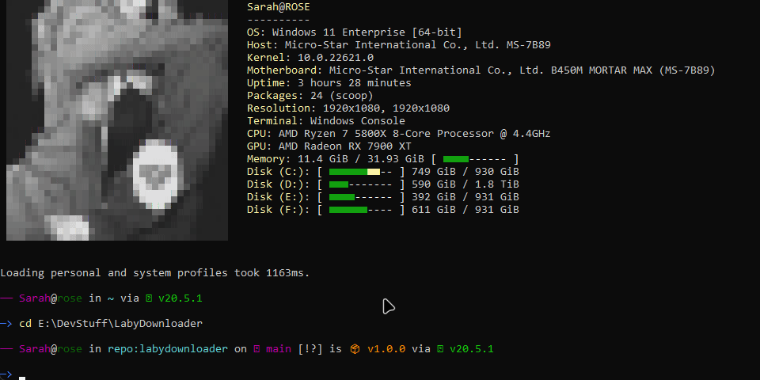

# LabyDownloader
Download a LabyMod-4 Jar to MultiMC/PolyMC or any directory to your PC :3

## Requirements
- Make sure you have [nodejs](https://nodejs.org/) installed.

## Usage

1. Create a folder where you place all the downloaded files
2. Open CMD inside the folder
3. Enter `npm i`
4. After it finished installing, enter `node index.js`
