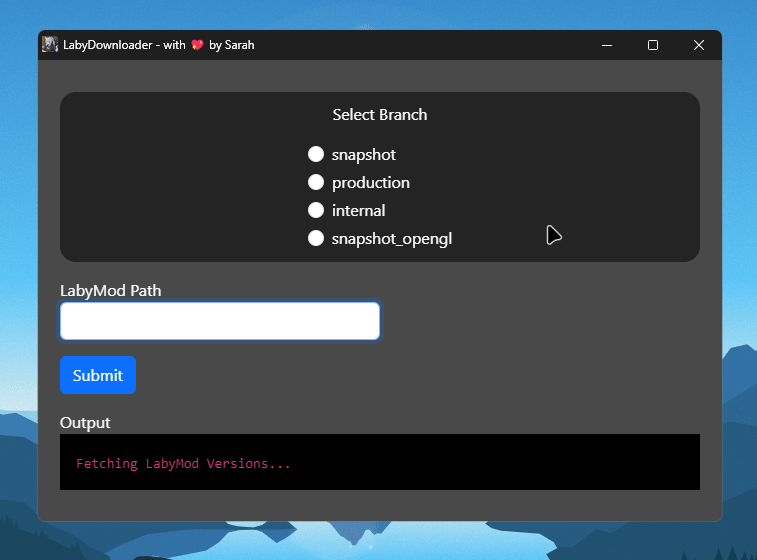

# LabyDownloader
Download a LabyMod-4 Jar to MultiMC/PolyMC or any directory to your PC :3

## Usage

1. Download the latest [Release](https://github.com/PrincessAkira/labydownloader/releases).
2. Unzip the **Release** 7z/ZIP from your Downloads folder into a folder.
3. Run the .cmd file.
